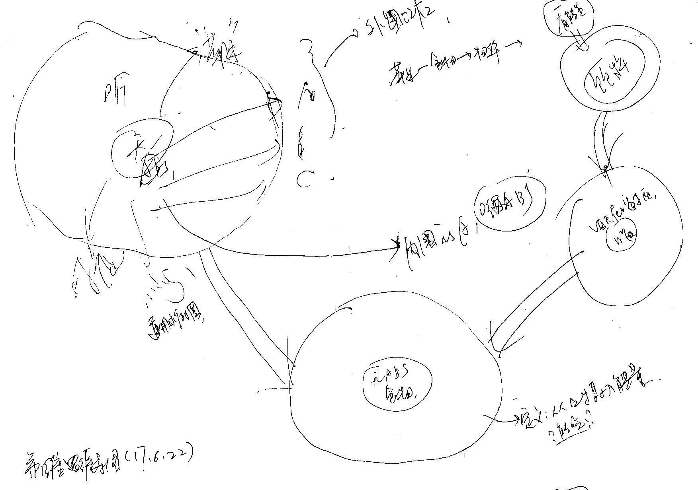
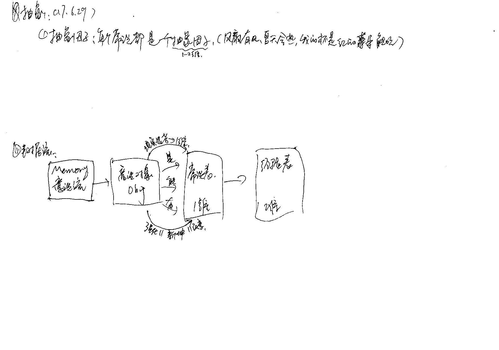
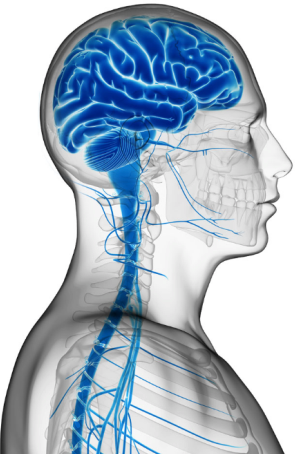

- ## 第1维思维导图(17.06.22)(N3P1)

***

- ## 3维架构图(17.06.23)(N3P2)

***
- ## (17.06.28)(N3P3)

***
- ## (17.06.29)(N3P4)

***
- ## (N3P5)

***
- ## (N3P6)

***

   

- ## (N3P7)数据树理论

   
AIDataTree

 

||Name|Size|Think方式|知识表示|GC|AILine策略|强化|
|---|---|---|---|---|---|---|---|
|1|AIInputFeel|超大|无|无|无|无|无|
|2|AIMemory|特大|InputFeel取参数据化,存value|总表(Memory),MK表(Img,Char,Obj,Do...)|特易|1天/Stong|无|
|3|AIAwareness|大|情境分块取参,存value|表(AIAwareness)|易|7天/主Strong|无|
|4|AICommonSense|中|意识流取参,存常识value|表(AICommonSense),分表(Is,Can...)|中|s灵活/主Strong|意识流类比唯一|
|5|AIExperience|小|组织常识,思考解决问题value|表(AIExperience),->习惯(AIHabit)|难|s灵活/Strong|反馈强化->习惯|
|6|	AIMindValue|特小|经验取参,存value|表(AIMindValue)|特难|
|7|AIMind|超小|AIMindValue取参,存权重|表(AIMind)|超固|		
> //注:所有数据有AILine指向强度的GC机制;  
> //注:大脑数据是完美的树;

- //思考AIMemory上下的关联;(是不是应该给每个Think.task制定一个id);
- //思考意识流指向(大脑数据的变化)

||首次|非首次|
|---|---|---|
|杯子是橘色|||
|杯子是用来喝水的|||
|杯子可以用来打人|||
|我现在渴了|||
|我有一个杯子|||
				
- //搜索;(闭上眼,依次说出赤cen黄绿青蓝紫的东西)
	1. 搜意识流(3小时内)
	2. 搜索常识(根据强度)
- 颜色值定义的作用;(例如:红黄绿蓝等12种基础色)
	1. 值域;(模糊范围)
	2. 根据值分类;
	3. 根据值索引搜索;
- [链接知识表示-AIMemory表Data结构](知识表示.md)

***

- ## **(N3P8)**

|||
|---|---|

 
AITree/BrainTree
 

||Name|对应|子|作用|工作方式|
|---|---|---|---|---|---|
|1|AIInputFeel|光|无|
|2|AIMemory|叶肉(光合)|总表(Memory),MK表(Img,Char,Obj,Do...)|
|3|AIAwareness|叶脉|表(AIAwareness)|
|4|AICommonSense|叶柄|表(AICommonSense),分表(Is,Can...)|
|5|AIExperience|树分枝|表(AIExperience),->习惯(AIHabit)|
|6|AIMindValue|树枝|表(AIMindValue)|
|7|AIMind|树干|表(AIMind)|
|8|MindControl|根|
|9|Mind元|根枝|Mine,Hunger...|

***
- ## (N3P9)神经网络-AILine  

* Type
    * 持续发送
    * 普通连接
    * 强度连接
* AILine是双向或多向的;而AIPointer是单指向的;
 
***

- ## (N3P10)思维演化(AI思维的本质)(17.07.14)
 

	> - SMG思维演化;(OOP2DataThink2AI)
	> 	- 概念:  
	> 		1. 把现有编程语言的所有类,抽象,属性等等存到db数据表;  
	> 		2. 把现有方法全改成泛型方法;  
	> 		3. 把现有方法的入参return 全记录到数据表;
	> 		4. 使用数据分析出曾经调用的abcdefg方法过程;
	> 		5. 抽象类比出当前新问题的解决方式;
	> 		6. 执行曾经的abcdefg;

***

- ## (N3P11)[Awareness->Demand->ThinkTask](../框架/Understand.md)  & [或旧资料Demand](../框架/Understand.md)

	> 

***

- ## (N3P12)[MainThread](../框架/Understand.md)

	- 代码
		- [链接](https://github.com/jiaxiaogang/SMG/blob/master/SMG_NothingIsAll/Class/AIFoundation/AIThread/AIMainThread.h)
	- 笔记
		- [Understand/MainThread链接](../框架/Understand.md)
 
***

- ## (N3P13)第六感与感觉
 
      - 成因:
         - 意识->需求间:(mind第六感)
              - 感性Awareness生成Demand时;会读取到很多mindValue.value;两者之间就会形成强化的关联;
              - 而这种强化是很难在今后说清楚原因的;
              - 所以感性者第六感更准确;
          - 认知->意识流:(感觉)
              - A与B经常有出现规律;
      - 本质:
          - AILine
      - 使用:
          - AILine的Strong值,影响到"权重";从而影响结果;但其是无因的;因为AILine不是AIObj存储;

          
          
***

- ## (N3P14)Demand的解

	- [链接~>Understand/ThinkDemand的解](../框架/Understand.md)
	- //ThinkDemand的解;
        1. 依赖于经验等数据;
        2. 依赖与常识的简单解决方案;(类比)
        3. 复杂的问题分析(随后再写)

***

- ## (N3P14)抽象(归纳)常识的设计

	1. 算法;
		1. 视觉算法
		2. 听觉算法
		3. 直接的数据输入;
		4. 运行方式:
			- "通行算法"直观体验
				- 只要数据进来立马会执行的算法;
			- "扩展算法"用心体验
				- mind驱动执行的算法;帮助人们更好的处理某事的细节;
					- 例如:欣赏音乐;
	2. 数据来源:
		- 自我感知
		- 外界输入
	3. 抽象因子:
		- 用于执行某一抽象任务;
			- 如:取颜色;
			- 如:将can eat存下来;

- ## (N3P15)意识(17.08.01)

	1. 意识的养料
		- 意识流
	2. //1,查询当前未处理的需求;看有没被解决掉;
	3. //2,思考充电状态与电量增加的逻辑关系;
	4. 意识流是一种"埋点"
		* 将代码产生的数据,进行收集;
	5. "意识"将意识流数据进行归纳,类比,统计;
		* "意识"会使用反射的方式调用runtime的方法来帮助"意识"执行任务;

	6. //从意识流Demand的解决到"抽象出常识";
	7. "苹果可以吃"是有意识抽象还是无意识抽象?
		- 肯定是有意识思考(?) 
	8. 驱动“意识”的也是Mind引擎吗?
		
		
		
		

		
		
		
		
		
		
		
		

