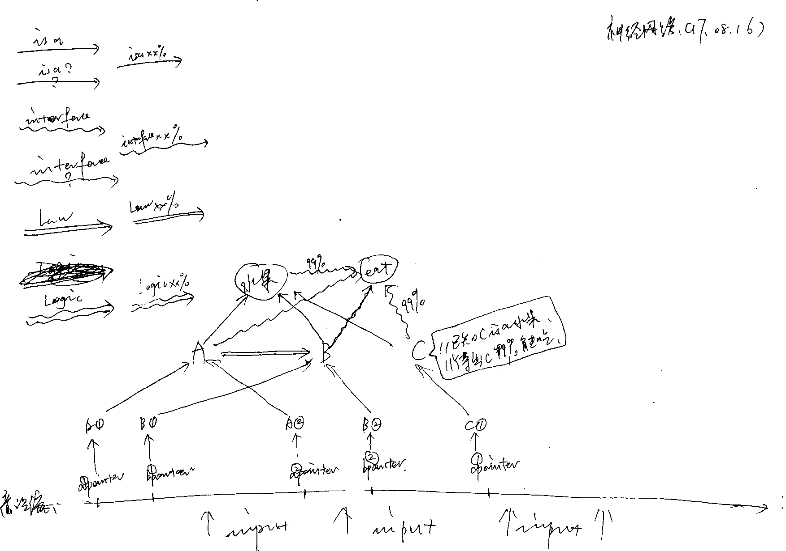
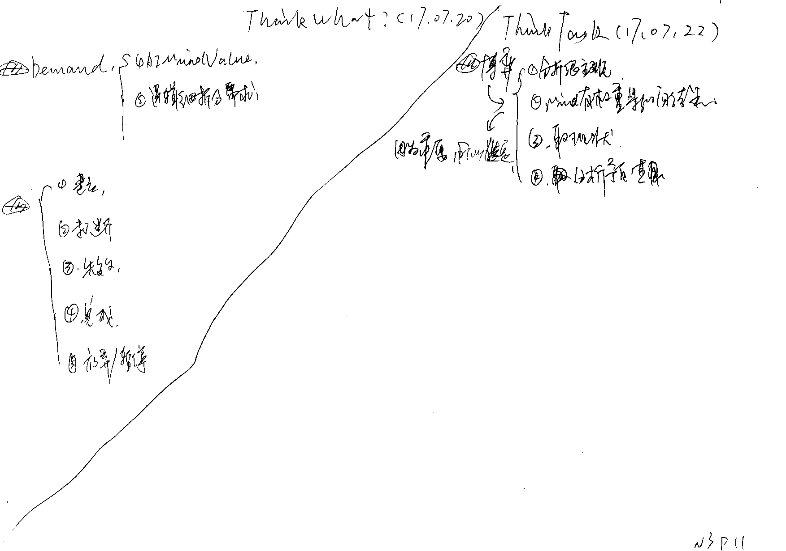
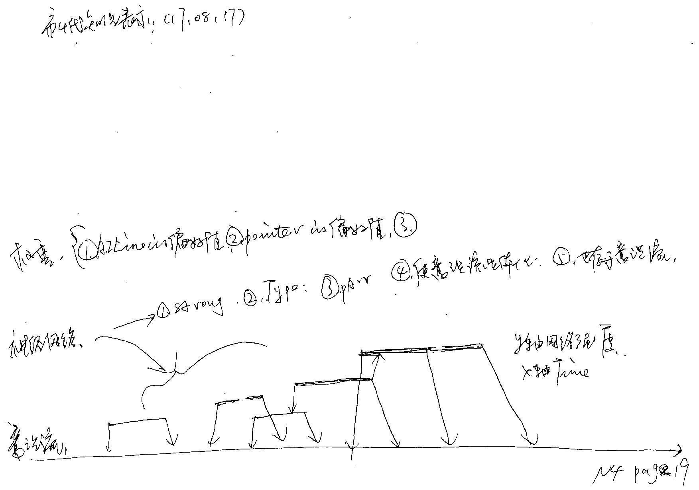

目录
=======

- [(N4P1)神经网络-AILine](#n4p1神经网络-ailine)
- [(N4P2)思维演化(#AI思维的本质)(17.07.14)](#n4p2思维演化ai思维的本质170714)
- [(N4P3)意识->需求](#n4p3意识-需求)
- [(N3P4)意识的主线程](#n4p4意识的主线程)
- [(N4P5)第六感与感觉](#n4p5第六感与感觉)
- [(N4P6)Demand的解](#n4p6demand的解)
- [(N4P7)抽象(归纳)常识的设计](#n4p7抽象归纳常识的设计)
- [(N4P8)意识(17.08.01)](#n4p8意识170801)
- [(N4P9)常识知识表示的拆分(17.08.02)](#n4p9常识知识表示的拆分170802)
- [(N4P10)神经细胞的算法:(17.08.02)](#n4p10神经细胞的算法170802)
- [(N4P11)AIMindValue(17.08.02)](#n4p11aimindvalue170802)
- [(N4P12)Demand(17.08.03)](#n4p12demand170803)
- [(N4P13)LOP(Layer Oriented Programming)(17.08.03)](#n4p13loplayer-oriented-programming170803)
- [(N4P14)意识流冥想(17.08.09)](#n4p14意识流冥想170809)
- [(N4P15)强化知识](#n4p15强化知识)
- [(N4P16)意识思考](#n4p16意识思考)
- [(N4P17)LightArea](#n4p17lightarea)
- [(N4P18)通用的感觉](#n4p18通用的感觉)
- [(N4P19)第4代知识表示(与神经网络贴合)](#n4p19第4代知识表示与神经网络贴合)

<br><br><br>

## (N4P1)神经网络-AILine  


* Type
    * 持续发送
    * 普通连接
    * 强度连接
    * 静态连接(直接关联关系)
* AILine的`pointers`是`双向或多向的`;
* 指针:`AIPointer是单指向的`;
  - 指针只是具备"唯一性"的AIPointer实例;而真正实体在"现实世界";
  - 调用"神经细胞算法"的时候,传参可以是"现实世界"的实体;
- AILine的`区域点亮`:[参考N4P17](#n4p17lightarea)

* AILine替代了AILaw和AILogic
* ???问题:“树形知识表示”结构越简单越好,复杂太高会导致数据迁徙中出现问题,甚至因为蝴蝶效应而导致大量的IO操作;
* ???思考:用AILine替代所有的逻辑;
  * 如果成立:那么
    1. 所有"树形知识表示"要推翻;
    2. 例如:为什么我见到不认识的水果,就会想到可能能吃;
      1. A与B共同Interface;可以抽象为:由两条网络分别连接A can Interface;和B can Interface;
      2. A与B再有共同的Base;可以抽象为:由两条网络分别连接A isa Base;B isa Base;
      3. 如果此时出现C;并且C isa Base;我们会判断AB等与can Interface连接的概率很大;从而判断C can? Interface;



<br>
***
<br><br>

## (N4P2)思维演化(AI思维的本质)(17.07.14) 

> - SMG思维演化;(OOP2DataThink2AI)
>   - 概念:  
>     1. 把现有编程语言的所有类,抽象,属性等等存到db数据表;  
>     2. 把现有方法全改成泛型方法;  
>     3. 把现有方法的入参return 全记录到数据表;
>     4. 使用数据分析出曾经调用的abcdefg方法过程;
>     5. 抽象类比出当前新问题的解决方式;
>     6. 执行曾经的abcdefg;
>   - 参考:[LOP](../框架/Understand.md)

<br><br>

- [ ] <font style="font-size:16px;background:#FFF000;">**Mind思考流程整理(17.08.13)**</font>
  1. **意识ActPoint(激活点)(来自自我感知)**
  2. **激活意识**
    1. 作MindValue准入判断(if(abs(mindValue)!=0)){})
    2. 意识主线程判断(false->stop true->next)
  3. **调用浅思考**
    1. 以ActPoint为中心BaseLightArea(基础点亮区域)
      - 以AILine来纵向点亮;(nil->后台异步横向IO类比&stop mArr-> next)

        > 注:所有的AILine都是纵向的,不是横向的  
        > 注:此处nil时的横向IO是抽象意识流的关键(发现AILaw)

    2. 取LightArea的结果mArr作"无辐射思考"  

      > 注:无辐射思考"  1. 只在当前mArr下类比 2. 综合MindValue值等操作 3. 不扩散加载数据 4.NoWrite操作

    3. 获取注意力:
      - 与当前Think.curTask对比;(false->stop true->next)
  4. **调用深思考**
    1. 根据AIMindValueModel生成需求(-10则努力到0;10则努力重复的10)
      2, ......
      <br>

- [ ] <font style="font-size:16px;background:#FFF000;">**Input思考流程整理(17.08.13)**</font>

  1. **意识ActPoint(激活点)(来自感观)**

    > 固有输入,调用基础算法函数

  2. **激活意识**
    1. 意识主线程判断(false->stop true->next)
  3. **调用浅思考**
    1. 作唯一性判断
    2. ......
    3. 与预测作对比......
    4. 获取注意力;
    5. 根据AIObj生成需求(生成不了,则)
    6. ......
  4. **调用深思考**
    1. ......


		```
		旧的(Input思考流程整理)--->无用,留存备份;
		1. 区域点亮(根据不同IO性能点亮区域大小自定)
		2. 预测与真实的变化引发的注意力;
		3. 引起变化后的索引生成;(如:车灯)
		4. 索引的搜索;(如:根据车灯搜索)
		5. 搜索结果的数据处理(类比分析与抽象等);
		6. "数据处理结果"的AILine生成与AILine.Strong;
		7. 
		```
	5. 例如:
	
			点名的时候,获取到注意力;
			从 "浅思考" 到 "深思考";


<br>
***
<br><br>


## (N4P3)意识->需求

> [Awareness->Demand->ThinkTask](../框架/Understand.md)  & [或旧资料Demand](../框架/Understand.md)
> > 

***


## N4P4意识的主线程

- 代码
  - [链接](https://github.com/jiaxiaogang/SMG/blob/master/SMG_NothingIsAll/Class/AIFoundation/AIThread/AIMainThread.h)
- 笔记
  - [Understand/MainThread链接](../框架/Understand.md)
  - [MainThread](../框架/Understand.md)

***


## (N4P5)第六感与感觉

  - 成因:
     - 意识->需求间:(mind第六感)
          - 感性Awareness生成Demand时;会读取到很多mindValue.value;两者之间就会形成强化的关联;
          - 而这种强化是很难在今后说清楚原因的;
          - 所以感性者第六感更准确;
      - 认知->意识流:(感觉)
          - A与B经常有出现规律;
  - 本质:
      - AILine
  - 使用:
      - AILine的Strong值,影响到"权重";从而影响结果;但其是无因的;因为AILine不是AIObj存储;


<br>
***
<br><br>


## (N4P6)Demand的解

- [链接~>Understand/ThinkDemand的解](../框架/Understand.md)
- //ThinkDemand的解;
    1. 依赖于经验等数据;
    2. 依赖与常识的简单解决方案;(类比)
    3. 复杂的问题分析(随后再写)

<br>
***
<br><br>


## (N4P7)抽象(归纳)常识的设计

1. 算法;
  1. 视觉算法
  2. 听觉算法
  3. 直接的数据输入;
  4. 运行方式:
    - "通行算法"直观体验
      - 只要数据进来立马会执行的算法;
    - "扩展算法"用心体验
      - mind驱动执行的算法;帮助人们更好的处理某事的细节;
        - 例如:欣赏音乐;
2. 数据来源:
  - 自我感知
  - 外界输入
3. 抽象因子:
  - 用于执行某一抽象任务;
    - 如:取颜色;
    - 如:将can eat存下来;
      1. 先知道吃了会饱,
      2. 才明白"can eat"是什么意思;
      3. 再去理解"xxObj"实物是可以吃的;
    - 饿时会烦,和意识知道饿时会烦是两回事;
    - 打时会痛,和意识知道打时会痛是两回事;

<br>
***
<br><br>


## (N4P8)意识(17.08.01)
> 参考:[自我->意识](../框架/自我.md## 意识)

1. 意识的养料
  - 意识流
2. //1,查询当前未处理的需求;看有没被解决掉;
3. //2,思考充电状态与电量增加的逻辑关系;
4. 意识流是一种"埋点"
  * 将代码产生的数据,进行收集;
5. "意识"将意识流数据进行归纳,类比,统计;
  * "意识"会使用反射的方式调用runtime的方法来帮助"意识"执行任务;

6. //从意识流Demand的解决到"抽象出常识";
7. "苹果可以吃"是有意识抽象还是潜意识抽象?
  - 肯定是有意识思考(?) 
8. 驱动“意识”的也是Mind引擎吗?
9. 两层
  - 第1层在Mind中,作意识心跳机制;
  - 第2层在Think中,作"有意识思考"、调用runtime方法等操作;


<br>
***
<br><br>


## (N4P9)常识知识表示的拆分(17.08.02)
1. 逻辑关联AILine;
  - 形成方式:
    - 通过"MindValue" & "类比" 的方式来达到AILine的强度与准确;
  - 细节:
    - 通过五观达到对现实的细节理解(如:勺子可以盛水(只有使用过工具,才知道其作用))
  - AILine强度的共享继承
    - Obj的抽象类;继承了AILine的"逻辑关联"时,同时继承其AILine强度;
2. 归纳:
  - Is a:
    - 抽象出A是ABase;
  - 分支结构:
    - ABase具有A1,A2,An...个子Obj;

<br>
***
<br><br>


## (N4P10)神经细胞的算法:(17.08.02)
- 算法的值定义:
  - x算法得出的值是精确的,不可解释的;
  - 值域定义可以给算法定义值(如:红橙黄绿青蓝紫黑白棕灰...)


<br>
***
<br><br>
​		
## (N4P11)AIMindValue(17.08.02)
- 简单性:
  - 只有Mind直接影响的意识数据才具有MindValue;
- ???问题
  - 所有意识流的新数据都会引起"意识"吗?还是只有MindValue的意识流数据才会引起意识;

  > 答:这属于"[意识思考](#n3p24意识思考)";所以必然引起"意识";但如果意识主线程忙时不引起"思考";

- MindValue.Type
  - mindValue感觉更细腻到附加值，而不是mindValue.Type。

  > 例如1:难以下咽的感觉(去索引搜索AILine点亮区域)
  >
  > 例如2:强迫症的人(就是想转笔)

- MindValue的从意识流移出,改用神经网络连接到Law(如Hunger)

<br>

***
<br><br>
​	
## (N4P12)Demand(17.08.03)
- 参考:N3P11
- 描述:对N3P11的细化分析;
- 产生源:
  - 由生理或Mind产生的硬性需求;
  - 由当前场景,当前情况产生的决策性需求;(如:提交开聚会时,向大家告知一声的需求)


<br>
***
<br><br>


## (N4P13)LOP(Layer Oriented Programming)(17.08.03)


#### <font color="red">**SMG的三个代码层**</font>

1. 函数层(只运算数据,不产生数据)  
  - 运行方式:
    - 定义好的method及流程算法等;
  - 种类:
    1. 算法
    2. IO数据库操作
2. 数据层(数据操作,不产生逻辑)
  - 运行方式:
    - 通过runtime来调用method;
  - 种类:
    1. 类比(提高准确),归纳(CommonSence),统计(AILine.Strong网络强度)
    2. 增删改查
3. 意识层
  - 运行方式:
    - 通过"意识心跳"和"意识流激活"的方式run & 产生Demand和数据分析并解决问题;
  - 种类:
    1. 意识心跳
      - xx秒一次的自省
    2. 意识流激活
      - 自我感知
      - Input

#### <font color="red">**LOP的特点:**</font>

- 以Data为核心的解释存储与逻辑;
- 更智能,更灵活,更通用

#### <font color="red">**LOP与OOP对比:**</font>

- LOP
  1. MethodLayer
    - 以method为基件(算法或IO或其它功能性的函数)
    - 封装
    - 效率
    - 泛型params和value
    - 单一职责的method(对应脑"常识突触")
    - 可被反射runtime调用
  2. DataLayer
    - 知识表示
    - 神经网络
    - 将OOP中的继承,接口,属性,值,多态,block等以Data的形式表示;
  3. AwarenessLayer
    - 参考:[N3P20](../手写笔记/Note3.md#n3p20demand170803)
    - 使Data产生逻辑;
    - 将OOP中的异步,多线程等以Awareness,Demand,Think等形式实现;


#### <font color="red">**LOP简述:(LOP思想的核心)**</font>

```
1. 我的LOP描述了;代码层;只是函数和算法;包括功能的打包;这些;
2. 数据层是存数据;存神经网络;让数据尽可能智能起来;没有性能问题;并且利于AI的使用
3. 而意识层;则感知自己的内心与需求;让数据活起来;有了逻辑;
```


<br><br>

## (N4P14)意识流冥想(17.08.09)

- 意识流冥想分析
  - AILine.Strong的形成;只是单一规律为索引的搜索;得到了更多的值;
- <font style="background:yellow">问:[意识流的抽象处理是基于有意识的,还是潜意识的?或者是两者集合的?](#N3P24意识思考)</font>

  > 答:意识流抽象常识的"意识思考"与"潜意识思考"相结合;


<br>
***
<br><br>
​		
## (N4P15)强化知识
1. 基于统计归纳
  - 基于意识流的统计;
  - 以count和"关联mindValue"产生AILine的基础强度;
  - 归纳出"2"所需的:常识,规律,经验表; 
2. 预测
  - 基于常识,规律,经验表的预测
  - 为强化提供了新途径(并非一次又一次的发生及统计;而是预测和反馈,带来的成就满足感,从而使mindValue多元化的强化AILine)
  - 使"1"的强化升华;

3. 生物脑:
  - [神经可塑性&LTP长期增益效应](../框架/神经网络.md#神经可塑性/LTP长期增益效应)

<br>
***
<br><br>
​		
## (N4P16)意识思考
- 分类
  1. 意识思考  

    > 指(意识)注意力引发的思考  

    - 分类  
      1. 基于[AIMindValue](#N3P19)

        > 以mindValue是区域点亮式索引搜索的.(快)(确定)

      2. 非[AIMindValue](#N3P19)

        > 而以其它关联的搜索是暴力与不靠谱的。(慢)(不确定)

    - 发生时机
      - 意识流数据变化时:
        1. 区域点亮(根据不同IO性能点亮区域大小自定)
        2. 预测与真实的变化引发的注意力;
        3. 引起变化后的索引生成;
        4. 索引的搜索;
        5. 搜索结果的数据处理(类比分析与抽象等);
        6. "数据处理结果"的AILine生成与AILine.Strong;
        7. xxx


	2. 潜意识思考

		> 指函数层的思考(每一次"意识思考"可能带动上万次"潜意识思考")  
		> 意识思考必然伴随着神经网络点亮区域。(点亮区域的数据就是"潜意识思考"的对象)
	
	3. 无意识思考
	
		> 在睡眠中/或者不存在的思考方式;(待验证)

<br>
***
<br><br>


## (N4P17)LightArea

`CreateTime 17.08.14`

1. 纵向点亮
  > 依赖抽象  
  > > 节点的AILine关联;

2. 横向点亮
  > 两种
  > > 1. 类比点亮  
  > 	- mindValue>0时的感觉;  
  > 	- 与前后发生的事件;(某时间跨度或意识流间隔)  
  > > 2. 暴力点亮  
  > 	- 需要时间,只能后台去点亮  

3. 特性
  > 根据关联点亮的数据区域;具有模糊性;因为网络的强化和关联,让模糊性的点亮具有了更高的有效率;

  > > 注:<font color="red">模糊性</font>是指根据AILine的搜索具有数据未知性,即搜索时,并不知道结果是否有效;

  > > 注:<font color="red">点亮</font>是指根据AILine的搜索具有强度导电性,点亮区域数据并操作;  

  > > 注:<font color="red">有效率</font>是指点亮的10000条数据中,有效解决了当前的数据需求;

<br>
***
<br><br>

## (N4P18)通用的感觉
`CreateTime 17.08.14`  
`//取数据简单;将数据感觉化才是难点;只有感觉化;才能理解数据;更快速准确的理解数据;`

> 1. 人
>   - 将量信息感觉化;
> 2. 机
>   - 将数字信息图形化;
>   - 设计一个向量GenaralFeel;
>     1. 动态dynamic
>       - x轴是时间,y轴填值;
>       - 如:
>         - 音乐
>         - 抛物线
>       - GF_dy是变速的点从A到B;是可以无限变化;
>       - 又可以无限叠加GF
>
>     2. 静态static
>       - 贝塞尔曲线
>       - 如:
>         - 物体外形
>       - GF_st是静态的曲线;
>       - 可各种叠加方式集成共同的感觉;


<br>

***

<br><br>

## (N4P19)第4代知识表示(与神经网络贴合)
`CreateTime 17.08.17`

* 层级
  1. 意识流
  2. 神经网络[参考:N4P1](#n4p1神经网络-ailine)
     ​	
     使意识流立体化

  3. 权重  

     使数据升华,多样化

* 图下:
  * 

<br>
***
<br><br>


