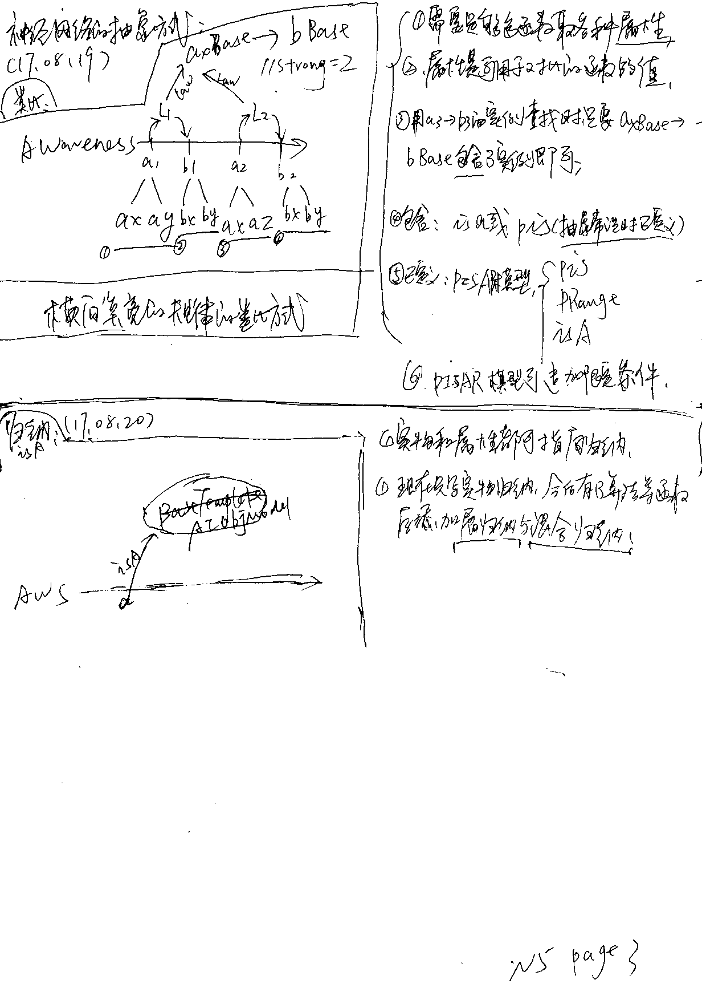

# 目录

* [N5P1流程图](#n5p1流程图)
* [N5P2智能神经网络](#n5p2智能神经网络)
* [N5P3神经网络的抽象方式](#n5p2神经网络的抽象方式)

   

## N5P1流程图

- [x] 外界Input数据  

`Input` >> `CodeLayer.Method` >> `无意识` >> `readData` >> `AILine.Strong++` >> `类比.唯一性判断` >> `取MindValue` >> `Awareness` `Awareness.MainThread` >> `取注意力` >> `WriteData` >> `记忆Memory` >> `意识流` >> `Think.潜意识` >> `AreaLight` >> `类比.抽象常识` >> `AILine` >> `Demand` >> `Think.Task` >> `有意识` >> 

- [x] Mind自我感知数据

``

## N5P2智能神经网络
`CreateTime 17.08.19`

* 参考:

	> 1. [(N4P1)神经网络-AILine](Note4.md/#n4p1神经网络ailine)  
	> 2. [(N4P19)第4代知识表示(与神经网络贴合)](Note4.md/#n4p19第4代知识表示与神经网络贴合)

* 智能AILine的概念:

	* 神经网络是智能的,其使用最简单的type,strong和pointers达到了:
		* `性能优化:"搜索索引","区域点亮"`
		* `一些关键的"知识表示",如常识:"AILaw","AILogic",再如理解:"关联"`
		* `帮助找到不可描述的目标如"算法","抽象知识"等`

* 智能AILine应用到(类比,归纳,统计)
	
	* 类比
		* 通过AILine点亮区域搜索到结果,然后类比,而类比依赖于AILine搜索到的pointers和strong的值;更依赖于常识知识和抽象;
	* 归纳
		* 通过`AILine.type == AILineType_IsA`的方式直接表示`a isa A`;
	* 统计
		* 统计的表示形式就是`AILine.strong`;

* Strong

	* strong的形成
		1. 生成+1
		2. 读写+1
		3. 常识预测与反馈+1
		4. 猜测与反馈+x`(x取当前猜测的影响范围)`
	* strong的共享机制
		1. 纵向共享
			
			> BE: a1 connect b1  
			> SO: a2 connect b2
			
		2. 横向共享
			> a law B  
			> 

- 静态量
- 动态量
	- 动态量可比较
	- 用比较衡量变化规则;
- 规则
	- 将输入的规则用于新的类比数据中...
	- 如:
		- 现规定0=10
		- 则0>9

## N5P3神经网络的抽象方式
`CreateTime 17.08.19`

> 

        
	