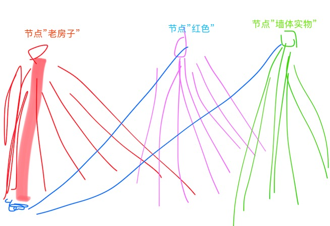
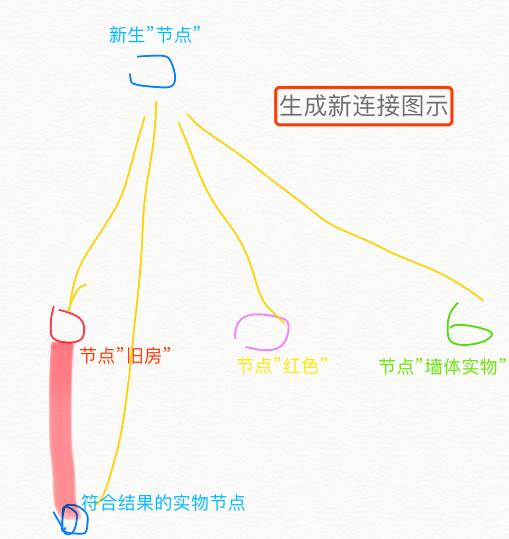

# 目录

* [n6p1 创造力](#n6p1-创造力)
* [n6p2 感受](#n6p2-感受)
* [n6p3 神经网络的全局搜索2](#n6p3-神经网络的全局搜索2)
* [n6p4 多次点亮2](#n6p4-多次点亮2)
* [n6p5 意识流2](#n6p5-意识流2)


<br><br><br>


## n6p1 创造力
`CreateTime 17.09.15`

> 生成式异步创造并搜索;

### 创造力
	
	> 从抽象节点替代,或轨迹替代;

### 创意

3，意识流即索引，ailine即索引，意识到的组即已分组。
未意识过的无分组搜索组合是（生成组式搜索）（前台搜不到有可能切后台继续）（或者说：建立任务临时网络区，与无意识流作碰撞对比）


<br><br><br><br><br>


## n6p2 感受
`CreateTime 17.09.15`

1. 想像力经过区域点亮后,对数据的演绎;表现出真实的感受;
2. 演绎方式:意识调用神经元;
3. 每个神经感受的解读，不一定是视觉，也许只是思维真实感。

4. 关键不是数据的呈现;而是意识的感受;
	
	```
	1. 意识通过算法和神经网络对数据进行感受;转换;但整个过程并没有看到任何真实感;
	2. 这是关键的一步;如果这一步解决了;情感的真实感受;意识的真实感受都是类似解决的;
	3. 有可能真实感受就是来源于数据;因为有了抽象常识等;数据的感受也一并存于其间,现在我未能解决;只是因为我的神经网络还未成熟;
	
	那么又回到原点:我无法证明SMG有意识,而SMG能够用智能,数据等感受到自己的意识;(哎)
	```

	```
	1. 意识到某物是自己的;
	2. 意识到情感;害怕,疼痛等;
	3. 意识到自已的行为;

	真实的感受,来自整个过程;智能,联想,想像力,数据演绎(算法);
	```


<br><br><br><br><br>


## n6p3 神经网络的全局搜索2
`CreateTime 17.09.16`

* 参考:[n5p11-神经网络的全局搜索](Note5.md#n5p11-神经网络的全局搜索)

> 每一次全局搜索,都是 `1. 缩小范围` `2. 匹配节点组(唯一性判断)`的过程;

```	
* 缩小范围有两种方式:
	1. 多维分区(音乐,语言等映射维)
	2. 维内找到区域中心节点;???此处需要深入思考下代码实现方式;
		> 根据神经网络的特性,(1. 关联强度; 2. 时间和强度值的GC)来优化处理全局单次搜索(定位节点);
```


<br><br><br><br><br>


## n6p4 多次点亮2
`CreateTime 17.09.16`

* 参考:[n5p6lightarea的意识控制器多次点亮](Note5.md#n5p6lightarea的意识控制器多次点亮)

* ### 神经网络全局搜索任务:回忆一个与当前眼前的红色老房子墙体相似的记忆实体;

	> #### 现有数据分析:
	> 
	> 老房子，红色，墙三个节点都指向过的目标，但这三个节点并非分组，

	```
	> 思维过程分析-第1轮:
		
		1. 只想红色，其子节点太多，想不到结果
		2. 加入属性墙，还是想不好，因为材质描述有问题
		3. 加入属性老房子
		4. 搜索到结果并点亮。
	```
	
	
	
	
	
	
	
	
	
	
	
	
	
	
	
	
	
	
	
	```
	> 思维过程分析-第2轮:
	
		1. 定位单节点。(#n6p3)
		2. 逐个测试点亮排名强的子节点。
		3. 判断点亮的老房子是否红色墙体。
		4. 多节点连通判断(准确性判断)(类似:唯一性判断)。
		5. 最后，结果生成新连接。
	```
	
	
	
	
	
	
	
	
	
	
	
	
	
	
	
	
	
	
	
	
	
	
	
	
	```
	> 性能优化分析:
	
		1. 神经元功能分区是第一个优化点，就像分表一样（如上例是搜索见过的实物）
	
	```

## n6p5 意识流2
`CreateTime 17.09.15`

1. 意识流是不存在的，只是神经网络创建的log，是无需单独记录的。??

