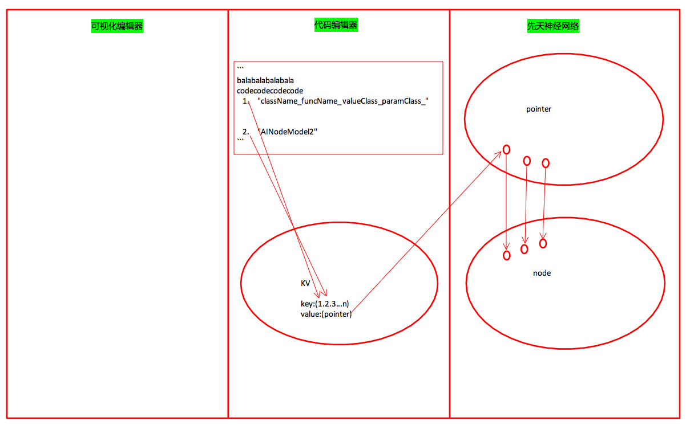

# 目录

* [n7p1 神经元与先天神经网络](#n7p1-神经元与先天神经网络)
* [n7p2 AINode模型](#n7p2-AINode模型)
* [n7p3 先天神经网络编辑器](#n7p3-先天神经网络编辑器)


<br><br><br><br>


## n7p1 神经元与先天神经网络
`CreateTime 17.09.21`


```objective-c
//
//  AINode.m
//  SMG_NothingIsAll
//
//  Created by 贾  on 2017/9/7.
//  Copyright © 2017年 XiaoGang. All rights reserved.
//

#import "AINode.h"

@implementation AINode

-(id) content{
    if (POINTERISOK(_contentPointer)) {
        return self.contentPointer.content;
    }
    return nil;
}

-(void) setContent:(id)content{
    if (self.type == AINodeType_Data) {
        
    }else if (self.type == AINodeType_Func) {
        //2. 反射子神经元
        //a. 取神经元算法数据
        AIFuncModel *funcModel = self.content;
        if (ISOK(funcModel, AIFuncModel.class)) {
            //b. 执行算法
            id value = [funcModel run:content];
            //c. 存算法值
            //...此处需要取到另一个存储结果的神经元节点;而Func节点;必定关联了两个(1. 多功能节点; 2. 存算法结果Data节点);
            //...两种解决方式;1. 分写几个AINode的子类; 2. 将AIPort分成四部分(传入,传出,存入,关联); 3. 保持现状,丰富type,使用判断type的方式解决;
        }
    }else if (self.type == AINodeType_MultiFunc) {
        //3. 功能型神经元将数据下发到子神经元
        //a. 遍历当前节点网口
        for (AIPointer *pointer in ARRTOOK(self.ports)) {
            AILine *line = pointer.content;
            if (LINEISOK(line)) {
                //b. 取此网线另一头节点
                NSArray *otherPointers = [line otherPointers:pointer];
                for (AIPointer *nodePointer in otherPointers) {
                    //c. 将数据传给另一头节点
                    AINode *node = nodePointer.content;
                    if (ISOK(node, AINode.class)) {
                        [node setContent:content];
                    }
                }
            }
        }
    }else{
        NSLog(@"AINodeType Is ERROR!!!");
    }
}


@end

```


<br><br><br><br>


## n7p2 AINode模型
`CreateTime 17.09.26`


<br><br><br><br>


## n7p3 先天神经网络编辑器
`CreateTime 17.09.27`

> 为调试和编辑方便,在代码中生成先天神经网络;




