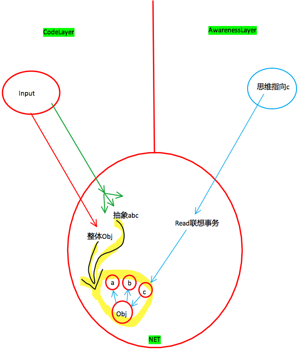
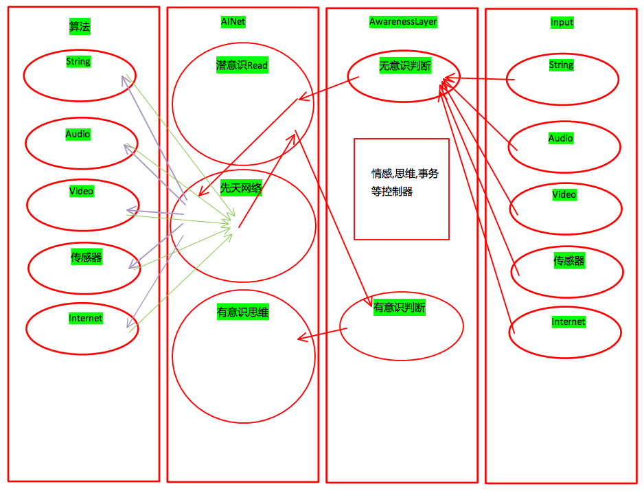

# AwarenessLayer-软件架构设计
***


# 目录

* [n8p1 AwarenessLayer软件架构初想法](#n8p1-AwarenessLayer软件架构初想法)
* [n8p2 意识真实的感受2-逆向演绎](#n8p2-意识真实的感受2-逆向演绎)
* [n8p3 精简意识控制器](#n8p3-精简意识控制器)
* [n8p4 SMG软件架构](#n8p4-smg软件架构)

<br><br><br><br>


## n8p1 AwarenessLayer软件架构初想法
`CreateTime 17.10.21`

##### <font color=red>前言:</font>
```
主要讲AwarenessLayer中的控制性,软件架构的实现和灵活编程方案;
```

##### <font color=red>定义:</font>

```
1. smg中意识定义:

    关于意识无明确定义,因为没有研究明白前无法确切定义;
    在smg中意识包含:`思维`,`智能`等所有smg主观性的体现;
    相当于AwarenessLayer中的代码引擎(众控制器的组合);

2. smg中智能定义:

    在smg中智能是以数据广泛性为基础的,

3.smg中的思考定义:

    思考是思维在神经网络具体事务上的体现
```

> 1. 智能与意识紧密关联:
>
>    如果没有意识,智能如散沙;
>
> 2. 智能的作用:
>
>     智能给DNA瘦身,给本体通用性熵减能力;

#### <font color=red>两个原则:</font>
```
1. 保证数据的灵活性;无论是接入思维还是意识或其它功能;
2. 保证awarenessLayer层的控制协调功能;而控制器的功能要分模块化;用接口的方式接入,并自动作用起来;
```

#### <font color=red>Controller</font>
```
1. 控制Demand/Task的持续性
2. 控制情感的持续性MindDurationManager
3. 控制主意识思维的事务同时单一控制器(一心一用)
4. 对当前自我感受状态的紧迫性HungerLevel<0.1f
5.
```


<br><br><br><br><br>


## n8p2 意识真实的感受2-逆向演绎
`CreateTime 17.10.22`

##### <font color=red>参考:</font>

```
n5p5
```

##### <font style="color:red">前言:</font>

```
思维再面向纯抽象节点时是无法思考的;

例如我们在选择红苹果好吃还是绿苹果好吃时,如果只是思考红色和绿色哪个好吃;

所以必须先行逆向演绎成红苹果和绿苹果,再来比较;
```

##### <font style="color:red">工作流程<font>

```
逆向演绎是将抽象节点指向实体obj节点的其它属性收集过来并有机结合的过程;此过程就是为了方便思维的思考元类比操作;所以有以下步骤:

1. 根据某抽象高层节点找到obj
2. 根据obj点亮其它属性节点
3. 将所有obj相关节点进行有机结合(可能这种有机只是划分区域边界)
4. 将所有边界内数据用于类比等;

注: 有可能思考过程中,只是多连续事务的控制过程;直到思考任务结束,都算是联想和逆向演绎阶段;
```

##### <font color=red>思考:</font>

```
1. 逆向演绎究竟存在不存在?或者说是否只是找到低节点后,read其属性的操作;
```

##### <font color=red>复合逆向演绎包括:</font>

```
1. 字符串逆向演绎
2. 音频逆向演绎
3. 视频逆向演绎
4. 空间逆向演绎
5. 时间逆向演绎

注: 任意一种会联想到其它;
```

##### <font color=red>示图:</font>




```
1. 蓝色:思维走向;
2. 左侧:神经网络构建流程;
```


<br><br><br><br><br>


## n8p3 精简意识控制器
`CreateTime 17.10.22`

##### <font color=red>参考:</font>

```
n4p7 & n4px
```

##### <font color=red>原始意识控制器:</font>

```
无，潜，有三种意识状态同时存在，互相共享数据合作。

1. 无意识:对应后台耗时任务 & 小脑任务;
2. 潜意识:对应未获取到注意力之前的任务;
3. 有意识:对应意识注意力思维思考等偏后行为;
```

##### <font color=red>精简意识控制器:</font>

```
1. 只存在潜过度到有意识的合作任务;
2. 最大的问题来自意识的灵活性;(随心所欲)
```


<br><br><br><br><br>


## n8p4 SMG软件架构
`CreateTime 17.10.22`

##### <font color=red>示图:</font>




- [ ] TaskList
  - [ ] 考虑去掉DataNode反射调用FuncNode;原因有二:
    1. 因为原input数据已经不见了;只能逆向演绎,不能传回重新神经元组处理;
    2. 因为multiNode的复杂性,也不建议这么写;(90%确定)


***
