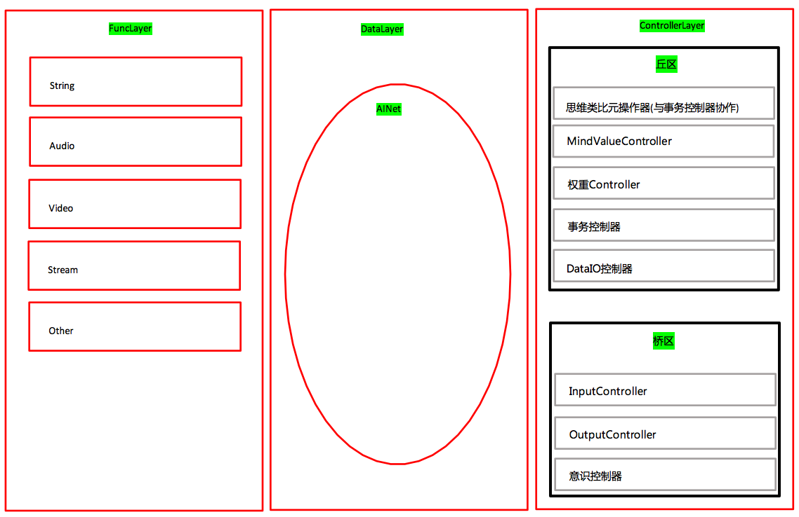
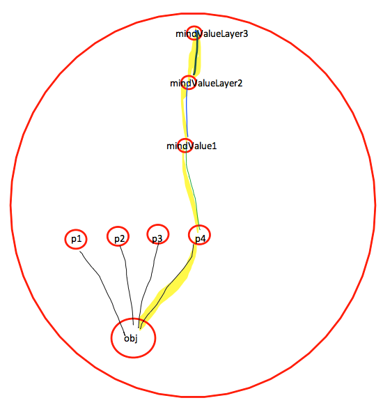

# AwarenessLayer-软件架构设计
***

<!-- TOC depthFrom:1 depthTo:6 withLinks:1 updateOnSave:1 orderedList:0 -->

- [AwarenessLayer-软件架构设计](#awarenesslayer-软件架构设计)
	- [n8p1 AwarenessLayer软件架构初想法](#n8p1-awarenesslayer软件架构初想法)
				- [<font color=red>前言:</font>](#font-colorred前言font)
				- [<font color=red>定义:</font>](#font-colorred定义font)
			- [<font color=red>两个原则:</font>](#font-colorred两个原则font)
			- [<font color=red>Controller</font>](#font-colorredcontrollerfont)
	- [n8p2 意识真实的感受2-逆向演绎](#n8p2-意识真实的感受2-逆向演绎)
				- [<font color=red>参考:</font>](#font-colorred参考font)
				- [<font style="color:red">前言:</font>](#font-stylecolorred前言font)
				- [<font style="color:red">工作流程<font>](#font-stylecolorred工作流程font)
				- [<font color=red>思考:</font>](#font-colorred思考font)
				- [<font color=red>复合逆向演绎包括:</font>](#font-colorred复合逆向演绎包括font)
				- [<font color=red>示图:</font>](#font-colorred示图font)
	- [n8p3 精简意识控制器](#n8p3-精简意识控制器)
				- [<font color=red>参考:</font>](#font-colorred参考font)
				- [<font color=red>原始意识控制器:</font>](#font-colorred原始意识控制器font)
				- [<font color=red>精简意识控制器:</font>](#font-colorred精简意识控制器font)
				- [<font color=red>精简意识控制器_有意识的特征:</font>](#font-colorred精简意识控制器有意识的特征font)
	- [n8p4 SMG软件架构](#n8p4-smg软件架构)
				- [<font color=red>示图:</font>](#font-colorred示图font)
	- [n8p5 事务控制器](#n8p5-事务控制器)
				- [<font color=red>前言:</font>](#font-colorred前言font)
	- [n8p5 AwarenessLayer软件架构初想法2](#n8p5-awarenesslayer软件架构初想法2)
				- [<font color=red>前言:</font>](#font-colorred前言font)
				- [<font color=red>结构:</font>](#font-colorred结构font)
	- [n8p6 LOP2](#n8p6-lop2)
				- [<font color=red>LOP2的概述</font>](#font-colorredlop2的概述font)
				- [<font color=red>LOP2的主要目的</font>](#font-colorredlop2的主要目的font)
	- [n8p7 意识思维与神经网络融合](#n8p7-意识思维与神经网络融合)
	- [n8p8 区域点亮2](#n8p8-区域点亮2)
				- [<font color=red>区域点亮与思维的融合:</font>](#font-colorred区域点亮与思维的融合font)
	- [n8p9 MindValue](#n8p9-mindvalue)
				- [<font color=red>概念:</font>](#font-colorred概念font)
				- [<font color=red>作用:</font>](#font-colorred作用font)
				- [<font color=red>MoodDurationManager概念:</font>](#font-colorredmooddurationmanager概念font)
				- [<font color=red>MoodDurationManager工作流程:</font>](#font-colorredmooddurationmanager工作流程font)
	- [n8p10 知识表示X](#n8p10-知识表示x)
			- [神经元逆向算法(错误)](#神经元逆向算法错误)
			- [思维对知识读取流程](#思维对知识读取流程)
			- [神经网络数据的单一性](#神经网络数据的单一性)
			- [神经网络数据的破单一性](#神经网络数据的破单一性)
	- [n8p11 ControllerLayer](#n8p11-controllerlayer)
	- [TaskList](#tasklist)

<!-- /TOC -->


<br><br><br><br>


## n8p1 AwarenessLayer软件架构初想法
`CreateTime 17.10.21`

##### <font color=red>前言:</font>
```
主要讲AwarenessLayer中的控制性,软件架构的实现和灵活编程方案;
```

##### <font color=red>定义:</font>

```
1. smg中意识定义:

    关于意识无明确定义,因为没有研究明白前无法确切定义;
    在smg中意识包含:`思维`,`智能`等所有smg主观性的体现;
    相当于AwarenessLayer中的代码引擎(众控制器的组合);

2. smg中智能定义:

    在smg中智能是以数据广泛性为基础的,

3.smg中的思考定义:

    思考是思维在神经网络具体事务上的体现
```

> 1. 智能与意识紧密关联:
>
>    如果没有意识,智能如散沙;
>
> 2. 智能的作用:
>
>     智能给DNA瘦身,给本体通用性熵减能力;

#### <font color=red>两个原则:</font>
```
1. 保证数据的灵活性;无论是接入思维还是意识或其它功能;
2. 保证awarenessLayer层的控制协调功能;而控制器的功能要分模块化;用接口的方式接入,并自动作用起来;
```

#### <font color=red>Controller</font>
```
1. 控制Demand/Task的持续性
2. 控制情感的持续性MindDurationManager
3. 控制主意识思维的事务同时单一控制器(一心一用)
4. 对当前自我感受状态的紧迫性HungerLevel<0.1f
5.
```


<br><br><br><br><br>


## n8p2 意识真实的感受2-逆向演绎
`CreateTime 17.10.22`

##### <font color=red>参考:</font>

```
n5p5
```

##### <font style="color:red">前言:</font>

```
思维再面向纯抽象节点时是无法思考的;所以具象问题如下:

例如我们在选择红苹果好吃还是绿苹果好吃时,如果只是思考红色和绿色哪个好吃;

所以必须先行逆向演绎成红苹果和绿苹果,再来比较;
```

##### <font style="color:red">工作流程<font>

```
逆向演绎是将抽象节点指向实体obj节点的其它属性收集过来并有机结合的过程;此过程就是为了方便思维的思考元类比操作;所以有以下步骤:

1. 根据某抽象高层节点找到obj
2. 根据obj点亮其它属性节点
3. 将所有obj相关节点进行有机结合(可能这种有机只是划分区域边界)
4. 将所有边界内数据用于类比等;

1. 只是想像力,区域点亮取出信息,类比;(简)
2. 取出信息后要整合;(中)
3. 整合后,要内识别理解具象的数据;(难)
4. 而理解具象数据其实也就是理解它的属性等抽象节点;(循环)

注: 有可能思考过程中,只是多连续事务的控制过程;直到思考任务结束,
都算是联想和逆向演绎阶段;

问: 理解,只是区域点亮相关数据,作数据关联映射;使经验跑进来;还是真的存在具象理解;
4中循环在时候中止;
```

##### <font color=red>思考:</font>

```
1. 逆向演绎究竟存在不存在?或者说是否只是找到低节点后,read其属性的操作;
```

##### <font color=red>复合逆向演绎包括:</font>

```
1. 字符串逆向演绎
2. 音频逆向演绎
3. 视频逆向演绎
4. 空间逆向演绎
5. 时间逆向演绎

注: 任意一种会联想到其它;
```

```
1. 将各种数据进行联想检索的能力;
2. 将各种数据进行想像融合的能力;(融合规则)
3. 将融合后的数据,演绎给大脑,或者是新的关联与节点数据存储;
```

##### <font color=red>示图:</font>


```
1. 蓝色:思维走向;
2. 左侧:神经网络构建流程;
```


<br><br><br><br><br>


## n8p3 精简意识控制器
`CreateTime 17.10.22`

##### <font color=red>参考:</font>

```
n4p7 & n4px
```

##### <font color=red>原始意识控制器:</font>

```
无，潜，有三种意识状态同时存在，互相共享数据合作。

1. 无意识:对应后台耗时任务 & 小脑任务;
2. 潜意识:对应未获取到注意力之前的任务;
3. 有意识:对应意识注意力思维思考等偏后行为;
```

##### <font color=red>精简意识控制器:</font>

```
1. 只存在潜过度到有意识的合作任务;(后台耗时任务 & input持续任务 都归到潜意识)
2. 最大的问题来自意识的灵活性;(随心所欲)
```
##### <font color=red>精简意识控制器_有意识的特征:</font>

```
1. 主线程同时执行一件思考任务
2. 注意力
3. 后天写权限
```


<br><br><br><br><br>


## n8p4 SMG软件架构
`CreateTime 17.10.22`

##### <font color=red>示图:</font>


<br><br><br><br><br>


## n8p5 事务控制器
`CreateTime 17.10.23`

`参考:` [N6P4](Note6.md#n6p4-多次点亮2)
[N5P6](Note5.md#n5p6lightarea的意识控制器多次点亮)

##### <font color=red>前言:</font>

```
1. 事务控制器,灵活的控制了AwarenessLayer对DataLayer的操作;
2. 需与意识合作,因为事务本身只负责区域点亮及其它事务执行,而不知道其结果是否中意;
3. 事务接口:(执行 & 添加 & 打断 & 驳回 & Success & Error & Failure 等)
4. 调用:(区域点亮调用,带方向的区域点亮调用,电量参数,是否可转为后台长时参数);
5. 思维抽象事务;
```


<br><br><br><br><br>


## n8p5 AwarenessLayer软件架构初想法2
`CreateTime 17.10.24`

##### <font color=red>前言:</font>

```
1. AwarenessLayer是引擎,SMG的CPU;
2. AwarenessLayer是事务控制器,
3. AwarenessLayer是重转站,大脑循环站;
4. ControllerLayer引擎,大脑的cpu;
```

##### <font color=red>结构:</font>

```
链式结构;每一节点都是控制器;分类器;决定下一站到哪;作什么事务;
```

```
1. input
2. 数据传递到:AwarenessLayer意识判断(此时,虽然不知道数据是什么,但可以判断`来源` 和 `数据量`)
3. 数据传递到神经元FuncLayer
4. 处理后输出给AINet
5. 由 `丘区` (mindValue)指引数据成长方向;
```

```
1. `桥区` 产生Demand 与 输入信息
2. 由输入信息到AINet检索经验作区域点亮等操作;
3. 事务控制器控制思维;在AINet中作类比等操作;
4. 思维控制器决策
5. 思维控制器将结果(一组输出值)返回给 `桥区` 的OutputController
n. output
```


<br><br><br><br><br>


## n8p6 LOP2
`CreateTime 17.10.24`




```
1. 算法层负责生产数据 和 其它控制器取值打辅助;
2. 数据层负责一切智能活动,等等参考前文神经网络;
3. ControllerLayer负责控制整个过程有序进行;
```

##### <font color=red>LOP2的概述</font>

```
其实人类的大脑也是几乎这样的模型;是个强化版的MVC;并且特别是Model层;(即神经网络)将很多Controller的功能作到Model中了;所以表现出了非常好的通用性灵活性和智能;
```

##### <font color=red>LOP2的主要目的</font>

```
我提出LOP的方式;最主要其实就两个目的;

1. 让人们将OOP忘掉;将OOP中的那些理念回归到数据中..
2. 让人们更加重视DataLayer层;因为数据带来的泛化能力和灵活性是前所未有的;
3. 让Controller的和思维类比等配合下,代码逻辑源于数据;
```


<br><br><br><br><br>


## n8p7 意识思维与神经网络融合
`CreateTime 17.10.24`

```
1. 融合，不止是事务与controller，其意义是意识思维与神经网络一起成长。

2. 即数据即思维升级,数据即意识升级;
```


<br><br><br><br><br>


## n8p8 区域点亮2
`CreateTime 17.10.25`

`参考:` [N4P17](Note4.md#n4p17lightarea)

##### <font color=red>区域点亮与思维的融合:</font>

```
1. 去掉电能量的设计;换成 `抑制` 和 `兴奋`;
2. 所以思维,是在每个DataNode神经元点亮时已经在跟着工作了,而非全部取完,作统一类比;这样的好处是:
	1. 大大提高区域点亮的效果;
	2. 可以更智能灵活的控制整个区域点亮的过程;
	3. 可以尽可能少的减少不必要的点亮与思维,性能更优化;
```


<br><br><br><br><br>


## n8p9 MindValue
`CreateTime 17.10.26`

`参考:`

[框架/Mind#MoodDuration心情持续](../框架/Mind.md#moodduration心情持续)

[Book心情持续](../Book/Chapters/Chapter8.md)

##### <font color=red>概念:</font>

```
意识思维通过MindValue的方式与AINet紧密合作,是数据的活跃剂,构建期监工,也是意识与数据的桥;让意识由神经反射升级成持续意识;
```

##### <font color=red>作用:</font>

```
1. mindValue在AINet中作用是指引成长方向;
2. mindValue在意识中作用是将神经反射作为持续的欲望或需求;
```

##### <font color=red>MoodDurationManager概念:</font>

```
1. MoodDurationManager属于丘区;mindValue功能体现之一;
```

##### <font color=red>MoodDurationManager工作流程:</font>

```
1. 持续内感受到 mindValue-;
2. AINet无记录时的手足无措,
3. 有记录时则促使smg去解决mindValue-的问题;
```


<br><br><br><br><br>

<font color=green>

## n8p10 知识表示X
`CreateTime 17.10.31`

#### 神经元逆向算法(错误)

* `Input写`->`神经元算法`->`思维分析结果`->`二进制存储`
* `二进制读取`->`神经元逆向算法`->`思维类比分析`->`Output读`

```
1. Gan逆向算法一一对应正向神经元算法。(错误)
2. AINet的节点数据是二进制，只有逆向算法后，才是节点整体信息。(错误)
3. 存在与否?

	应该不存在,数据的实物与属性,具象与抽象的关系应该是存在神经网络中...
```

#### 思维对知识读取流程

```
1. 区域点亮
2. 节点数据读取
3. 节点数据的整体复合(复合参考:n8p2)
4. 成为完整的想象力事务。
```

#### 神经网络数据的单一性

```
1. 神经网络只存算法结果(不存mp4mp3)
2. 只强化思维结果的关联
```

#### 神经网络数据的破单一性

```
1. 神经网络通过mindValue与深入思维(冥想)整理,

使事物抽象与本质产生关联;

将看似均匀的可能性,导向更正确的关联可能性;
```

| 数据整理过程图: |
| --- |
|  |
| 1. 黑线:obj与property之间的关联; |
| 2. 黄线:obj与p4之间产生强关联;(与深入思维后mindValue123三层的继承有关) |
| 3. 绿线:本来p4或obj与mindValue1的相关 |
| 4. 蓝线:本来mindValue1 与 mindValue2 mindValue3的相关|
| 注: 冥想或思维只是强化关联 |
| 注: 深入思维只是描述了思维的层级,并非单纯围绕外围世界展开,而是围绕任意层次节点展开 |


</font>


<br><br><br><br><br>

<font color=green>

## n8p11 ControllerLayer
`CreateTime 17.11.01`

|  | 控制器 | 生命周期 | 主任务demand | IO |
| --- | --- | --- | --- | --- |
| 1 | 思维控制器 | 构造 析构 |  |  |
| 2 | AINet事务控制器 |  |  |  |

</font>


<br><br><br><br><br>


## TaskList

- [ ] 考虑去掉DataNode反射调用FuncNode;原因有二:

	```
  1. 因为原input数据已经不见了;只能逆向演绎,不能传回重新神经元组处理;
  2. 因为multiNode的复杂性,也不建议这么写;(90%确定)
	```

- [ ] 改变神经网络结构;(依Note8内容改变)


***
